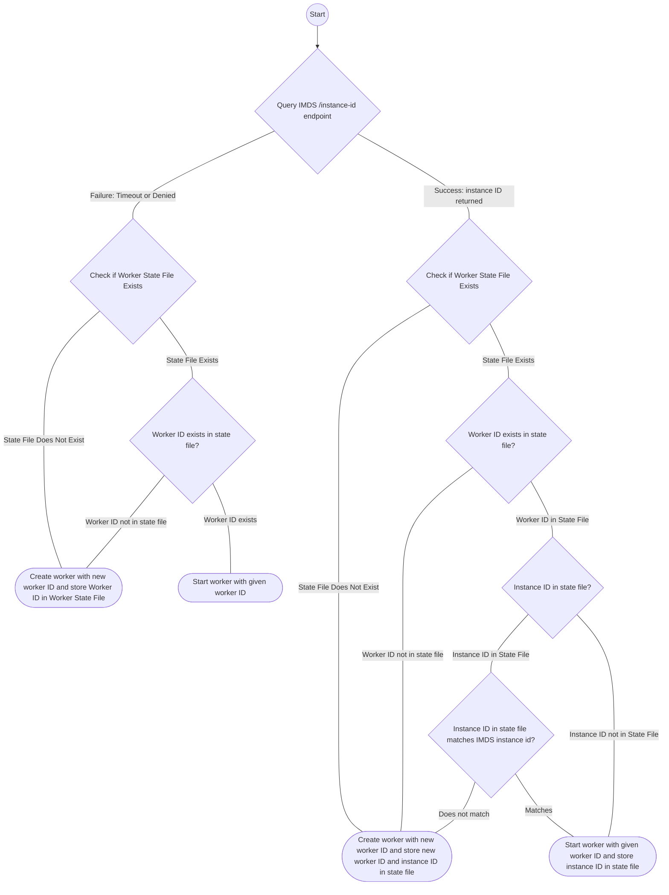

# State

The worker agent writes files to disk containing data about the worker state.

## Persistence Directory

The **persistence directory** (also referred to as the cache directory) is created by the
`install-deadline-worker` command (see the "Setup worker host" in the top-level
[`README.md`](../README.md)) and used by the worker agent and runtime.

It defaults to the following paths based on the host platform:

| Platform | Default persistence directory path |
| --- | --- |
| Linux | `/var/lib/deadline` |
| MacOS | `/var/lib/deadline` |
| Windows| `%PROGRAMDATA%/Amazon/Deadline/Cache` |

The structure of the persistence directory is:

```txt
<PERSISTENT_DIR>/
├── credentials/
│   ├── <WORKER_ID>.json
├── queues/
│   ├── <QUEUE_1_ID>
│   │   ├── get_aws_credentials.sh
│   │   └── iam_credentials.json
│   └── <QUEUE_2_ID>
│       ├── get_aws_credentials.sh
│       └── iam_credentials.json
└── worker.json
```

**It is recommended if you are preparing an Amazon Machine Image (AMI) or a disk image, to delete 
the worker persistence directory before making the image in order to prevent all hosts using that 
image from running with the same worker ID.**

### Worker state file

Path: `<PERSISTENCE_DIR>/worker.json`

The worker maintains a worker state which is a JSON representation of the following structure:

```jsonc
{
    "worker_id": "<WORKER_ID>",
    "instance_id": "<INSTANCE_ID>"  # OPTIONAL
}
```

#### `worker_id`

This contains a unique identifier that represents the worker in your AWS Deadline Cloud fleet.


#### `instance_id`

This is an optional parameter which contains an identifier of the EC2 instance running the worker, if applicable. 


#### How the State File Affects Startup Behavior

When the agent starts up, it checks for the worker state file and these values. If a `worker_id` is 
found, and an `instance_id` in the file either matches that of the running host or is not present, 
the worker agent will transition the worker to the `RUNNING` state and begin running as the
worker.

If the worker state file is not found, contains no value for `worker_id`, or contains a `worker_id` 
with an `instance_id` that is different than the `instance_id` detected on the running host, then 
the worker agent will create a new worker in the AWS Deadline Cloud fleet and persist the 
`worker_id` and `instance_id` to the worker state file. 

The above logic is represented in the diagram below.



## Worker AWS credentials

Path: `<PERSISTENCE_DIR>/credentials/<WORKER_ID>.json`

The worker agent assumes the fleet role scoped down with permissions for its specific worker. This
is done by making an `AssumeFleetRoleForWorker` API request. This returns temporary IAM credentials
for the worker assume role session.

The worker agent persists these temporary credentials to disk in the event that the worker agent
program exits and needs to be restarted to avoid the need to make an additional
`AssumeFleetRoleForWorker` API request.

The structure of these files is:

```json
{
    "Version": 1,
    "AccessKeyId": "...",
    "SecretAccessKey": "...",
    "SessionToken": "...",
    "Expiration": "<YYYY>-<MM>-<DD>T<HH>:<MM>:<SS>Z"
}
```

These credentials can be used to grant IAM permissions for the worker. The worker agent assigns the
file to only be accessed by the worker agent user. Review
["Security best practices in IAM"][iam-security-best-practices] when handling worker AWS credentials
files.

[iam-security-best-practices]: https://docs.aws.amazon.com/IAM/latest/UserGuide/best-practices.html#bp-workloads-use-roles

## Queue AWS credentials

Structure:

```txt
<PERSISTENT_DIR>/
└── queues/
    └── <QUEUE_ID>
        ├── config
        ├── credentials
        ├── get_aws_credentials.sh    # POSIX
        ├── get_aws_credentials.cmd   # Windows
        └── iam_credentials.json
```

When the worker agent is assigned a worker session for a queue with an associate IAM role, the
worker agent will assume the queue role and make the AWS credentials available to the session
actions it runs as subprocesses.

This is done using the following procedure:

1.  create a queue AWS credentials directory
2.  write `config` file
3.  write `credentials` file
4.  write `get_aws_credentials.sh` on POSIX or `get_aws_credentials.cmd` on Windows
5.  write `iam_credentials.json` containing the temporary credentials in the format expected
    by the AWS CLI and SDKs


When the worker agent creates subprocesses for session actions, it specifies the path to the
`config` and `credentials` files in the queue AWS credentials directory in the `AWS_CONFIG_FILE` and
`AWS_SHARED_CREDENTIALS_FILE` environment variables supported by official AWS SDKs & Tools
([docs][aws-config-credentials-path-override]).

These credentials can be used to grant IAM permissions for the queue. The worker agent assigns the
file to only be accessed by the worker agent user. Review ["Security best practices in
IAM"][iam-security-best-practices] when handling worker AWS credentials files.

[aws-config-credentials-path-override]: https://docs.aws.amazon.com/sdkref/latest/guide/file-location.html#file-location-change

## Session directories

The worker agent creates a session directory for each worker session it runs. The session
directories are created in a platform-specific path:

| Platform | Session directory path |
| --- | --- |
| POSIX | `/sessions/<SESSION_ID>` |
| Windows | `C:\ProgramData\Amazon\OpenJD\<SESSION_ID>` |

These directories are populated by the worker agent with files created to run the session. This
includes:

*   materialized [Open Job Description `<EmbeddedFile>s`][openjd-embedded-files]
*   input/output job attachments

[openjd-embedded-files]: https://github.com/OpenJobDescription/openjd-specifications/wiki/2023-09-Template-Schemas#6-embeddedfile

By default, the worker agent deletes worker session directories after they are completed. The
directories may be kept if the agent exits abnormally or if the agent is configured to retain
worker session directories using:

*   `--retain-session-dir` command-line argument
*   `DEADLINE_WORKER_RETAIN_SESSION_DIR` environment variable
*   the `[os]` &rarr; `retain_session_dir` setting in the worker agent config file (see [configuration][])

[configuration]: ./configuration.md

These directories contain job data and should be secured accordingly. Consult the
[security best practices][aws-deadline-cloud-security-best-practices].

[aws-deadline-cloud-security-best-practices]: https://docs.aws.amazon.com/deadline-cloud/latest/userguide/security-best-practices.html#worker-hosts
